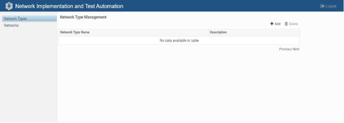
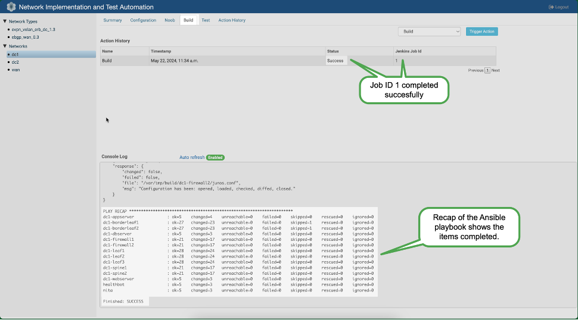
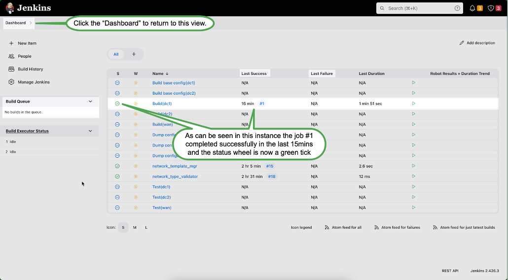
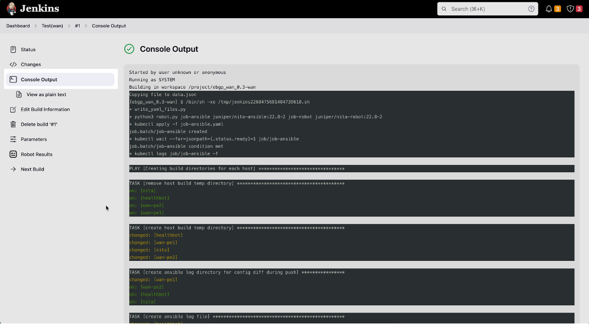
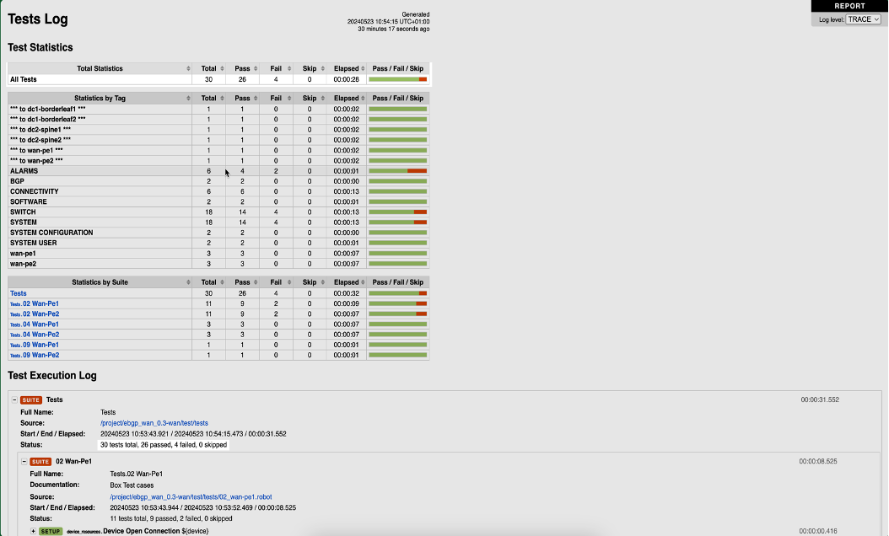
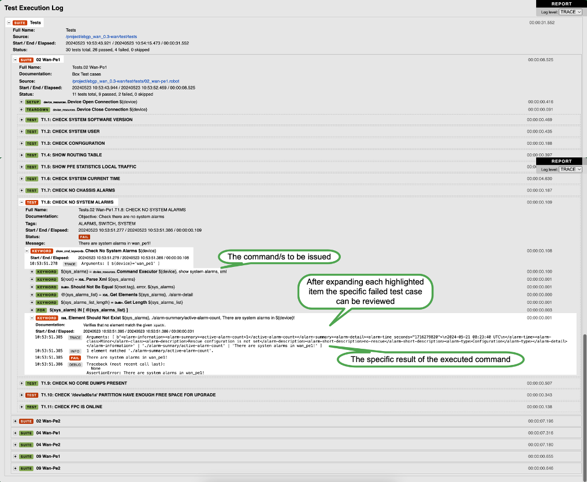

**Project Name : NITA**

## Introduction

-------
This document serves as a guide demonstrating selected NITA features utilised in the Examples, drawing upon best practices to meet technical requirements for enabling NITA. It provides a detailed exploration of the outcomes related to the provided example items (EVPN and eBGP).

**Contents**

- [Introduction](#introduction)
- [Lab Example build process](#lab-example-build-process)
  - [File Storage](#file-storage)
  - [Startup/install script](#startupinstall-script)
  - [Adding the Networks](#adding-the-networks)
  - [Load Configuration Data](#load-configuration-data)
- ["NOOB (New Out Of the Box)" process](#noob-new-out-of-the-box-process)
- [Running the Build Process](#running-the-build-process)
  - [Monitor NITA UI Build process](#monitor-nita-ui-build-process)
  - [Monitor Jenkins Build Process](#monitor-jenkins-build-process)
- [Executing the Testing Process](#executing-the-testing-process)
  - [NITA Build process and execution monitoring](#nita-build-process-and-execution-monitoring)
  - [Jenkins Build process and execution monitoring](#jenkins-build-process-and-execution-monitoring)
- [Reviewing the Test output](#reviewing-the-test-output)
  - [Jenkins Results](#jenkins-results)
  - [Jenkins expanded results view](#jenkins-expanded-results-view)

## Lab Example build process

To begin the lab build process clone the Example files for the lab build process from the [NITA repo](https://github.com/Juniper/nita.git) locally to your machine and verify that you can access the following directories:

- [*nita/examples/evpn\_vxlan\_erb\_dc*](https://github.com/Juniper/nita/tree/main/examples/evpn_vxlan_erb_dc)

- [*nita/examples/ebgp\_wan*](https://github.com/Juniper/nita/tree/main/examples/ebgp_wan)

The above directories are required to proceed with the Example - You will need access to these directories during the procedure.

### File Storage

After you have cloned the repo to your local machine proceed to zip the example folders for upload into the NITA webapp - **ensure** to preserve the directories locally to make it easier to access some specific files used during the build process going forward.

```zip -r evpn_vxlan_erb_dc.zip examples/evpn_vxlan_erb_dc```

```zip -r ebgp_wan.zip examples/ebgp_wan```

By using the latest repo and following these steps will ensure that you have access to the most up-to-date examples ready for the lab build process in the next steps - please also note at this point that if you need to modify the relevant device data to accommodate your lab nodes you will need to refer to the [projects.md](https://github.com/Juniper/nita/blob/main/docs/projects.md) and follow the relevant instructions within.

### Startup/install script

Within the NITA repo proceed to review the README.md file located in the root directory: [Juniper/nita](https://github.com/Juniper/nita/tree/main?tab=readme-ov-file#installation), this describes the process required to initiate the installation script.\
Open a new terminal window in the NITA repo root directory and follow the instructions laid out.

*Please note: Ensure to leave the NITA process to completely build the pods prior to attempting to access the portals defined -- this process can take around 20+mins to complete, it has to download the images required and start the pods, once completed you will be able to use the NITA web application and later the Jenkins portals, to check on the progress of this stage use the **nita-cmd kube pods** cli command and observe the pod status.*

**Webapp portal for Nita UI:**\
At the end of the installation process you will be provided with relevant URLs for NITA (```https://"YOUR-NODE-IP"``` & ```https://"YOUR-NODE-IP":8443```) - Proceed by logging into the NITA webapp UI using the default credentials:
| Username | Password |
|---|---|
| ``vagrant`` | ``vagrant123`` |


Upon successful login, you will be directed to the NITA UI homepage:



Within this interface, navigate to the left-hand pane and click on the \"Network Types\" section. Subsequently, click on the \"add\" button located in the right-hand pane.


Next, locate the example files/folders that you previously compressed in the [File Storage](#file-storage) step and when prompted, specify the location of your zip files on your local machine. Upon successfully completing the steps outlined, you will observe the examples appearing within the \"Network Types\" section of the NITA webapp portal.


Ensure to complete this action for **both** network types:

- EVPN VXLAN Example

- eBGP WAN Example

### Adding the Networks

Following a similar method used in the previous step we will now populate the network type generated above.\
Click on the \"Networks\" item located in the left-hand pane beneath the \"Networks Type" and on the right hand side proceed to click on the \"add\".  At this point provide a name for the network, for this example we will use \"dc1\" (*make sure not to include any spaces in the name as this is not permitted*) and input the description as \"datacenter 1\" then select the **evpn_vxlan_erb_dc_1.3 Network Type** which was created in the previous step from the drop-down menu.\
For the required host file navigate to the uncompressed location from the [File Storage](#file-storage) section and locate the [examples/evpn\_vxlan\_erb\_dc](https://github.com/Juniper/nita/tree/main/examples/evpn_vxlan_erb_dc) folder and following our example select the \"dc1-hosts\" file contained within - Click on \"Save\" to add the hosts' file.\
After completing the network addition process, you should observe the following changes within the Nita Webapp portal.


Next, proceed to add Datacenter 2 and WAN following the steps described above while maintaining the naming convention described and modifying the drop-down menu selections:

| Name | Description | File | Drop-down Menu |
|---|---|---|---|
| dc1 | Datacenter 1 | dc1-hosts | ebgp\_vxlan\_erb\_dc\_1.3 |
| dc2 | Datacenter 2 | dc2-hosts | ebgp\_vxlan\_erb\_dc\_1.3 |
| wan | WAN | hosts | ebgp\_wan |

Once you have completed adding the networks and network types you should be presented with three new networks (dc1, dc2, and wan) all initialized and ready for use.


### Load Configuration Data

Now the network types have been generated we can populate them as required with the relevant device data, begin by selecting "Networks" in the left pane and navigate to the required network object, followed by clicking on the "configuration" tab on the right (highlighted below) - this step will be repeated for each network created, in the example we will complete this for dc1, dc2 and wan.


To load the data for each device we need to import an excel data spreadsheet, this is achieved by selecting the "import" option from the webapp portal and proceeding to locate the required file for the relevant network, following on for our example we proceed to locate \"[*nita/examples/evpn\_vxlan\_erb\_dc*](https://github.com/Juniper/nita/tree/main/examples/evpn_vxlan_erb_dc)\" and \"[*nita/examples/ebgp\_wan*](https://github.com/Juniper/nita/tree/main/examples/ebgp_wan)\" directories from our local [File Storage](#file-storage) and choose the relevant xlsx file related to the network.\
Repeat this process for all the networks created, ensuring to load the appropriate files from the directories.

- dc1\_data.xlsx -
    [*nita/examples/evpn\_vxlan\_erb\_dc*](https://github.com/Juniper/nita/tree/main/examples/evpn_vxlan_erb_dc)

- dc2\_data.xlsx -
    [*nita/examples/evpn\_vxlan\_erb\_dc*](https://github.com/Juniper/nita/tree/main/examples/evpn_vxlan_erb_dc)

- ebgp\_wan.xlsx -
    [*nita/examples/ebgp\_wan*](https://github.com/Juniper/nita/tree/main/examples/ebgp_wan)

After the completion of this stage each network should be populated similar to the example output shown below for dc1:


## "NOOB (New Out Of the Box)" process

Some projects may require you to carry out the NOOB (**N**ew **O**ut **O**f the **B**ox) Process if you are setting up the system from a newly installed VM or hardware installation, this "NOOB" process can configure a device via the console and proceed (if required) to upgrade the Juniper OS, but in the current examples this step is not used and can be skipped.

## Running the Build Process

Now we have networks and configuration data for the nodes we can proceed to begin running the build process for each network (dc1, dc2, and wan), this stage is straightforward.\
Begin by selecting "Networks" in the left pane to expand the items underneath and navigate to the required network object (dc1), click on the \"Build\" tab within the righthand pane  and from the drop-down menu select \"Build\", once selected proceed to click the  \"Trigger Action\" button.

*Note: It\'s essential to wait for the dc1 build process to finish before initiating the dc2 or wan build process; this might take approximately 20 minutes for each process.*


You have the option to track the progress of the Ansible playbook execution either within the NITA build console or alternatively, you can monitor the progress by directly accessing the Jenkins server interface - each option is explained next.

### Monitor NITA UI Build process

Monitoring the NITA Web portal UI build progress is as easy as clicking the "Console Log: Auto refresh: Enable" option and the playbook will proceed in the window displayed, all output from the task is shown and you can scroll up and down in the output window to review the actions progressed, this can also be used at a later stage to review previously completed jobs as well as to monitor the current job:



### Monitor Jenkins Build Process

Another method to monitor the build process is via the Jenkins application web portal, proceed to open the Jenkins IP/Port and you will be presented with the home page, at this point in the example you will observe the new tasks running on the left side of the panel and you can monitor the progress of the tasks running or task which have already been completed, clicking on each of the tasks executed/running  will open a new page/tab and allow you to see further details, in our example we click the task indicator in the left-hand pane and open a new page/tab:


Within the newly opened tab, clicking on the \"Console Output\" option located in the left-hand pane will display the device console output from the Ansible playbook as it continues to operates/progress.


Upon completion you will see the results in output window and you can then return to the dashboard and verify from the status table the last time the job/task was executed and the state of that task at completion, this applies to all running or completed tasks within Jenkins.



It is crucial to run the build process for each \"Network\" element (dc1, dc2, and wan) before proceeding to the ROBOT Framework steps. This ensures that the configurations are properly applied and tested for each network created.

By following these detailed steps, you have effectively run the build process for each network, monitored the progress, and followed the successful execution of an Ansible playbook for comprehensive network setup and testing.

## Executing the Testing Process

Once you have completed the build steps for the topologies, we can now execute the ROBOT Framework jobs for each network (dc1, dc2, and wan).

### NITA Build process and execution monitoring

Again, we begin by selecting "Networks" in the left pane to expand the items, navigate to the required network object we want to run tests against in the left pane, followed by clicking on the to the \"Test\" tab in the right-hand pane, select \"Test\" from the drop-down list and then click \"Trigger Action.\"
As per the [build process](#monitor-nita-ui-build-process) we can see the results of the test cases once it has been triggered using the NITA webapp portal, you can select to monitor the build process here by clicking on the "Console Log: Auto refresh: Enable" option and the playbook will proceed in the window displayed allowing you to review its progress in real-time or you can skip to the next section and monitor via the Jenkins UI

*Please ensure to wait for the completion of the dc1 test process before initiating the dc2 or wan test process.*


### Jenkins Build process and execution monitoring

The Jenkins UI showcases the test results through its integration with Robot framework. To implement this method, proceed as per the [build process](#monitor-jenkins-build-process) and pinpoint the ongoing test and open the console view.
After you have clicked the running test case a new tab opens showing the output in real-time as if you were present on the console itself:



## Reviewing the Test output

Now the tests has been executed we can return to the status tab (upper left) to review the log for the completed test.  Click on the \"Open \*.log html\" option provided to access the test case details and view the results.


### Jenkins Results

The results page reinforces the status of the test cases executed, providing insight into the specific tests performed. For instance, the results indicate that 30 test cases were conducted against the device/s, with 26 passing and 4 failing (highlighted in screen shot below).\
Scroll down to review the failed cases. By clicking the \"+\" sign next to each failure, we can examine each specific test case executed, showcase the commands issued to the device/s and the corresponding output from that command, this is then matched against the expected state of the test case to determine if the test is a success or failure.



### Jenkins expanded results view

As an illustration, a failure in a ROBOT test case executed against the \"Wan-Pe1\" device is highlighted. By expanding the elements(\"+\"), you can view the exact command issued (e.g., \"show system alarms\") along with the observed discrepancy, in this example the \"System Alarms\" being present during the testing process, contrary to the expected test case state of "No Alarms".\

*The failure details provide specific information about the alarm detected on the device in question.*



***Thank you for reading, this concludes the overview of the NITA Examples.***
